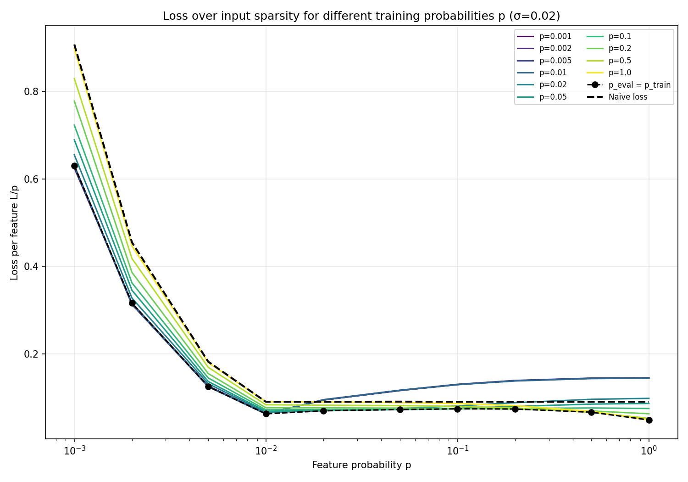
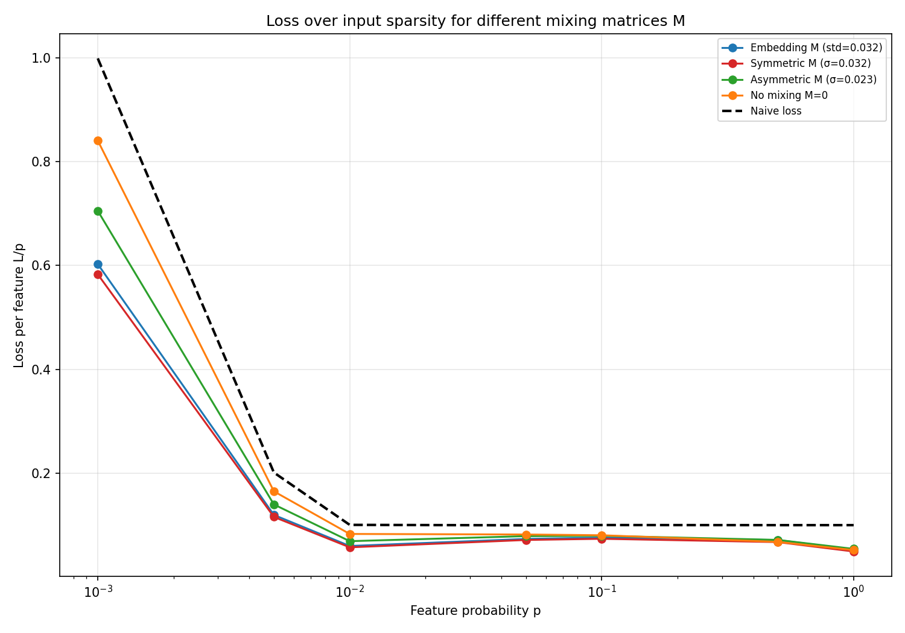
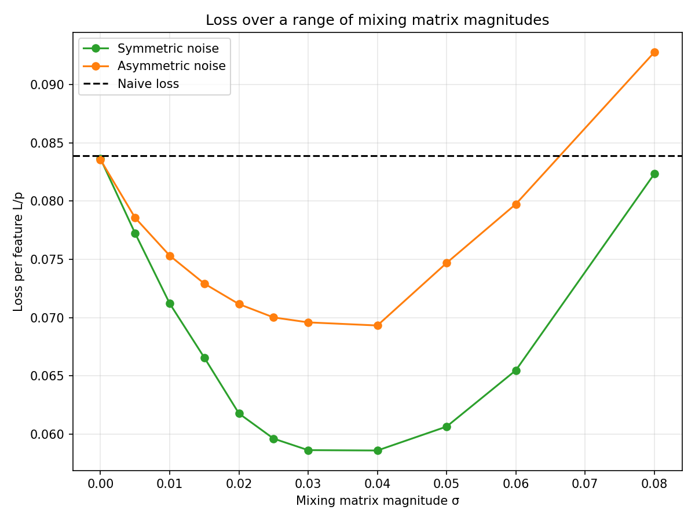
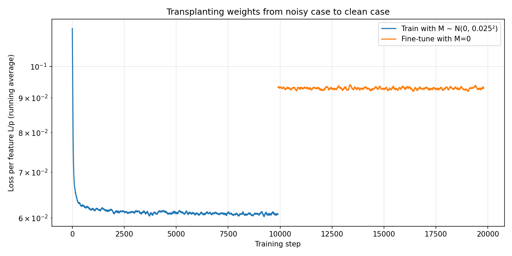
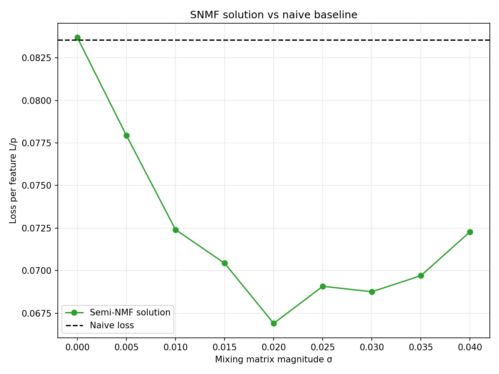
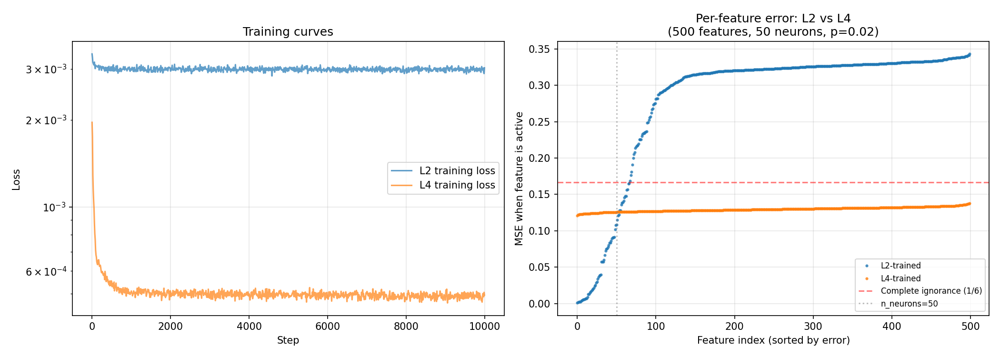
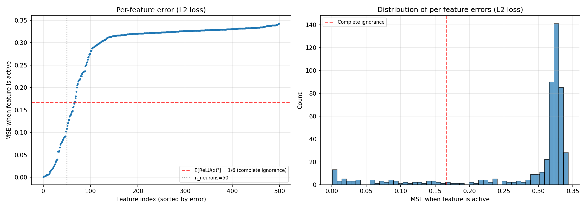
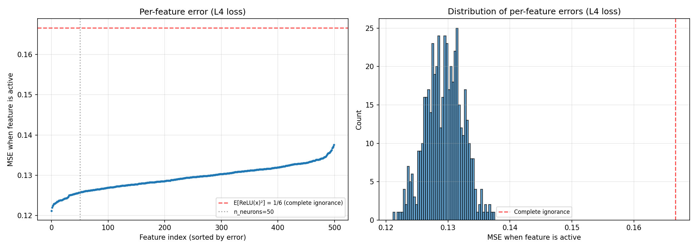

# Replicating "Compressed Computation is (probably) not Computation in Superposition"

## Background

Braun et al. (2025) proposed a toy model of "compressed computation" (CC): a residual MLP with 50 neurons that seemingly computes 100 ReLU functions on sparse inputs. The architecture uses a fixed random embedding matrix W_E (with unit-norm rows) and W_U = W_E^T, a residual stream of width 1000, and trains on labels y_i = x_i + ReLU(x_i).

Bhagat et al. (LessWrong, June 2025) showed that this model's advantage over a naive baseline comes from exploiting noise introduced by the embedding matrices, not from genuine computation in superposition. They demonstrated that the residual connection with fixed embeddings is equivalent to a "mixing matrix" M = I - W_E W_E^T that mixes features into each other's labels. The full model simplifies to a plain MLP trained on y = ReLU(x) + Mx.

We replicate the key results from Bhagat et al. to validate their claims.

## Setup

Following Bhagat et al., we use the simplified equivalent model:

- **Input**: x in R^100, sparse (each x_i ~ Uniform[-1,1] with probability p, else 0)
- **Model**: y_hat = W_out @ ReLU(W_in @ x), with W_in (50x100) and W_out (100x50)
- **Labels**: y_i = ReLU(x_i) + sum_j M_ij x_j
- **Loss**: MSE
- **Training**: Adam, lr=0.003, cosine schedule, batch size 2048, 10k batches

We test several mixing matrix choices:
- **Embedding M**: M = I - W_E W_E^T (the original Braun et al. setup)
- **Symmetric random M**: entries ~ N(0, sigma^2), symmetrized
- **Asymmetric random M**: entries ~ N(0, sigma^2)
- **Clean M = 0**: no mixing

The **naive baseline** dedicates one neuron per feature for 50 features and outputs zero for the other 50.

## Results

### Experiment 1: Two qualitative solution regimes (cf. Figure 2)

We train models at 10 different sparsity levels and evaluate each across the full range of evaluation sparsities.

This reproduces the original's key finding of two qualitatively distinct solution types:
- **CC solutions** (low training p, dark curves): perform well on sparse inputs but worse on dense inputs. These curves rise toward the right.
- **Dense solutions** (high training p, bright curves): show constant or improving loss at higher densities.

Both solution types beat the naive baseline (dashed) in their respective regimes. The black dots show each model evaluated at its training sparsity.

Note: our y-axis range is larger than the original's (~0.9 vs ~0.12 at the sparse end), likely due to a difference in how L/p is normalized at extreme sparsities with maximally-sparse evaluation. The qualitative structure matches.

### Experiment 2: Embedding M behaves like random noise (cf. Figure 5a)

We compare four M types, training and evaluating at the same sparsity.

This validates the paper's central claim: the embedding-like M from Braun et al. (blue) produces essentially the same behavior as a symmetric random M with matched standard deviation (red). All non-zero M variants beat the naive baseline at low p. Crucially, **M=0 (orange) never beats the naive baseline** — it tracks right along or above the dashed line. This confirms that the CC model's advantage comes entirely from the mixing matrix, not from computing ReLU in superposition.

### Experiment 3: Loss scales with noise magnitude (cf. Figure 5b)

We train models at p=0.01 for a range of sigma values, testing both symmetric and asymmetric noise.

This matches the original's Figure 5b. Both curves show a U-shape:
- At sigma=0, loss equals the naive baseline (~0.084)
- Loss decreases with increasing sigma, reaching a minimum around sigma=0.03-0.04
- At large sigma (>0.06), loss rises again as the noise overwhelms the task

The symmetric noise curve achieves lower loss and has a wider "beats naive" range than asymmetric, matching the original. This is direct evidence that the model's advantage comes from exploiting the mixing matrix: more noise = more to exploit = lower loss (up to a point).

### Experiment 4: Transplant from noisy to clean (cf. Figure 6)

We train a model on noisy labels (M ~ N(0, 0.025^2)) for 10k steps, then fine-tune on clean labels (M=0) for another 10k steps, reusing the same optimizer.

The loss jumps immediately when switching to clean labels — from ~0.06 to ~0.095 L/p — and stays elevated. This rules out the hypothesis that the CC solution was learned due to training dynamics that happen to generalize to the clean case. The model genuinely depends on the mixing noise to achieve its low loss.

### Experiment 5: SNMF analytical solution (cf. Figure 9)

We construct model weights analytically using semi non-negative matrix factorization (SNMF) of M+I, without any training.

The SNMF solution beats the naive baseline for a range of sigma values (roughly 0.005 to 0.04), confirming that the mixing matrix structure alone provides a recipe for beating naive loss — no gradient-based training needed. The trained model still achieves lower loss than SNMF, suggesting it finds additional optimizations beyond simple matrix factorization.

## Known Limitations

- **Y-axis scale**: Our Figures 1 and 2 show a wider L/p range at low sparsity compared to the original, likely due to normalization differences when using maximally-sparse evaluation. The qualitative patterns match.
- **Mechanistic analysis omitted**: We did not replicate Figures 7 and 8 (neuron-eigenvector alignment and W_out W_in correlation with M). These would require longer training for clean results.
- **Dense solution analysis omitted**: Figure 10 (naive + offset model for the dense regime) was not replicated.
- **Transplant scheduler**: Phase 2 uses a fresh cosine schedule rather than continuing the decayed one, which means the LR restarts. This is a methodological difference from the original.

## Conclusion

All core claims from Bhagat et al. replicate qualitatively:

1. The CC model's performance depends entirely on the mixing matrix M
2. With M=0, the model cannot beat the naive baseline
3. The embedding-like M from Braun et al. is equivalent to simple random noise
4. The model's advantage scales with the noise magnitude sigma
5. Weights trained on noisy data do not transfer to clean data
6. An analytical SNMF solution can also beat naive loss

This confirms that compressed computation, as formulated by Braun et al., is likely not a suitable toy model of computation in superposition.

## Part 2: Toward a genuine CiS toy model

### Motivation

Given that compressed computation is not CiS, can we design a toy model that genuinely exhibits it? Lucius Bushnaq's comment on the LessWrong post offers a key insight:

> Computation in Superposition is unlikely to train in this kind of setup, because it's mainly concerned with minimising *worst-case* noise. [...] A task where the model is scored on how close to correct it gets many continuously-valued labels, as scored by MSE loss, is not good for this.
>
> I think we need a task where the labels are somehow more discrete, or the loss function punishes outlier errors more [...]

The intuition: L2 loss is tolerant of "spreading" error unevenly across features. A naive solution that perfectly computes 50 features and ignores 450 can achieve low *average* L2 loss because the ignored features contribute a bounded amount each. But a loss function that punishes outlier errors more harshly (like L4 or higher) makes it costly to completely ignore any feature — incentivizing the model to spread its capacity across all features, even at the cost of per-feature precision.

### Setup

We modify the compressed computation setup:
- **500 features, 50 neurons** (10:1 overcompleteness ratio, up from 2:1)
- **p = 0.02** (~10 features active per input)
- **M = 0** (no mixing matrix — any advantage must come from genuine CiS)
- **Task**: y_i = ReLU(x_i) (pure ReLU, no mixing term)

We compare two loss functions:
- **L2 loss**: |y_hat - y|^2 (standard MSE)
- **L4 loss**: |y_hat - y|^4 (punishes outlier errors more harshly)

The naive baseline dedicates one neuron per feature for 50 of the 500 features and outputs zero for the rest. For the ignored features, the expected error when active is E[ReLU(x)^2] = 1/6 ≈ 0.167.

### Result: L4 loss elicits CiS

The right panel shows per-feature MSE (sorted) for both models. The result is striking:

- **L2-trained** (blue): ~50 features are well-computed (low error), while the remaining ~450 sit at or above the "complete ignorance" line (red dashed, 1/6). This is essentially the naive solution — the model dedicates its neurons to a subset of features and ignores the rest.

- **L4-trained** (orange): *all 500 features* have roughly the same error (~0.12), uniformly below the ignorance line. The model has spread its 50 neurons across all 500 features, computing each one imprecisely but none of them ignored.

This is exactly the signature of computation in superposition: the model uses an overcomplete set of directions in its 50-dimensional hidden space to represent and compute all 500 features simultaneously, accepting interference noise as the cost.

The per-feature coverage plots confirm this:

### Why this works

L2 loss is indifferent between "compute 50 features perfectly, ignore 450" and "compute all 500 at moderate accuracy" when the total error is the same. In fact, the L2-optimal strategy is to concentrate capacity on a subset — since the per-feature error from ignoring is bounded (1/6), and computing perfectly saves that entire 1/6, while splitting a neuron across multiple features saves less per feature.

L4 loss changes the calculus. Ignoring a feature costs (1/6)^2 = 1/36 per occurrence in L4 terms, while a small residual error epsilon costs epsilon^4 ≈ 0. The penalty for complete ignorance is disproportionately large relative to the penalty for imprecise computation. This incentivizes the model to allocate at least *some* capacity to every feature.

### Next steps

The L4-trained model appears to genuinely compute in superposition. The next step is to reverse-engineer what the model is actually doing:
- How are the 500 features represented in the 50-dimensional hidden space?
- What interference patterns arise when multiple features are active?
- Does the model use a structured overcomplete basis (e.g., approximate equiangular tight frame)?

## Files

- `replicate.py` — Replication experiment code (Part 1)
- `cis_experiment.py` — CiS experiment code (Part 2)
- `figures/` — All generated plots
- `data/` — Raw experiment data (NPZ files)
- `weights/` — Saved model weights (L2 and L4 trained models)
